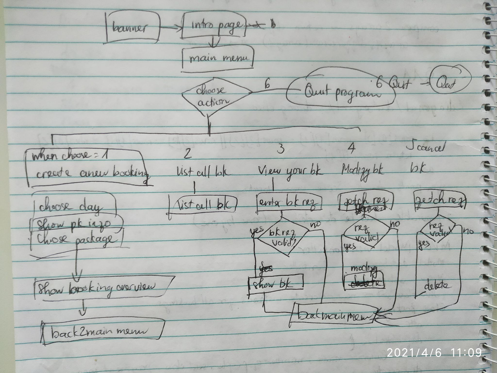
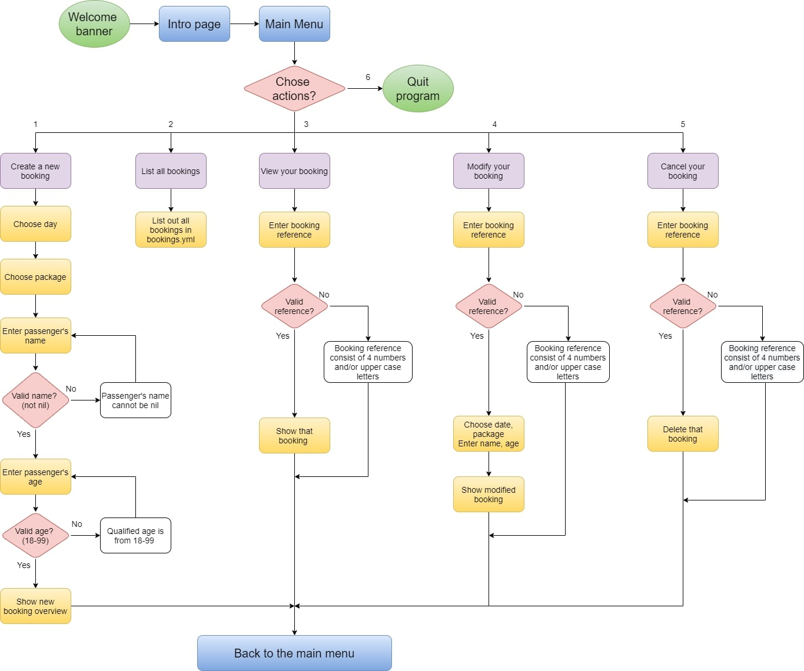

# T1A3 Workbook
Full name: Phuong Anh Dang (Olivia)

Sydney, April, 2021

Source control repository: https://github.com/Olivia-dang/MoonTrip-booking-app

> ### Description

This is a Moon Trip booking system. This application will help tour company to arrange their tour and manage number of passengers. End-users (tourists) can interact with the application to see tour information, packages and book their slots.

As a tour booking application, this app can create a booking, modify a booking, view a booking, delete a booking. Those are basic functions that end-users (tourists) would like to do when booking a tour. I also created "list all bookings" function. This is basically just for the tour company to manage all bookings. 
Moon Trip booking system will enhance customer's experience and help the travel company with better management.

Target audience: Moonlight Travel (the tourism company) and their end-user(tourists)

> ### Features
- Show company banner and Moon Trip information


- Main menu to choose next action (CRUD)

- User friendly error feedback
- Persistent storage: booking information is stored in a .yml file.
- Engaging UI: used Ruby Gems to display better user interface and get user input


> ### Installation

##### 1. Download zip file or clone to your workspace

`git clone https://github.com/Olivia-dang/MoonTrip-booking-app.git`
`cd src`

##### 2. Install bundler and gem

Check if bundler has been installed or not:
`gem list bundler`

**If yes**, continue with installing all dependencies in the Gemfile
`bundle install`


**If no**, install it and add gems
`gem install bundler`
`bundler init`
Copy this to the Gemfile:
```
gem "tty-prompt", "~> 0.23.0"
gem "tty-table", "~> 0.12.0"
gem "colorize", "~> 0.8.1"
gem "tty-font", "~> 0.5.0"
gem "rspec", "~> 3.10"
```
Then run `bundle install` in the terminal window.

##### 3. Run the application

Run the bash script file
`./run_app.sh`

If the bash script file doesn't work, please try
`ruby main.rb`

> ### Usage
##### 1. Create a booking:
- Choose date 

- Choose package

- Enter name 
- Enter age (18 - 99)


Application will show a confirmation of completion


##### 2. List all booking:
This function is mainly for travel company and administration to manage all bookings


##### 3. View your booking:
Enter booking reference to see a specific booking


##### 4. Modify your booking:
Enter booking reference and then fill in booking infomation again (date, package, name, age)

##### 5. Cancel your booking:
Enter booking reference to delete.

##### 6. Quit:
Quit the program
> ### Errors handling with user input
- Invalid name: passenger's name
Valid name is comprised of letters, "-", ".", " ". After 3 times with invalid name, the program will return to the main menu.

- Invalid age: passenger's age
Passenger's age must be from 18-99. This Moon Trip is for adults only.
After 3 wrong inputs, the program will return to the main menu.

- Invalid booking reference:
Booking reference is comprised of uppercase letters and numbers. User will have to enter the correct format to pass.

In `View your booking`, if the booking reference is incorrect (not exist in the database), an error message will be displayed.

In `Cancel your booking` and `Modify your booking`, if the booking reference is incorrect, the program will directly return to the main menu.

> ### Design process
#### Idea

When I heard about the terminal app assignment, I kept thinking what I would like to do? I looked up in the night sky and smiled: “Let’s go to the moon”. And that’s how I started making a Moon Trip Booking System.
At first, I want to make a flight booking system to the Moon only, but people can't just take a flight by rocket to the Moon, because they cannot travel by themselves, book an Airbnb elsewhere and find their own food. Therefore, it makes more sense if I offer a Full Package Moon Trip with date and package options.

I drafted a control flow model so that i can visualize my imagination about the app. I draw it in my notebook.


Then I created a Trello Board with cards, requirements and to-do tasks. 


#### Control-flow diagram
Basically, unless user choose to quit, or else any function will also redirect to the main menu.



> ### Implementation plan
**Features:**
- CRUD functionality (basic for a tour booking system)
- Engaging UI: using gems to change text font, multiple choice, make table, change text color.
- Persistent storage: I use .yml file to store bookings data.

**Deadline and checklist tasks**

Day 1:
- draw a sketch to visualize Moon Trip booking system
- read more about MVC models
- start coding `create a booking` function to get user input
- `create a booking`: 
    - make a class called Booking as a form for each booking instance.
    - use `TTY::Prompt.new.ask` to change how to get user input
- create folders as in MVC models and move my code to different files accordingly

Day 2
- `create a booking`:
    - create a mock project learn to use YAML to as persistent data storage.
    - read and write data to YAML
    - finish "create a booking" function

Day 3
- `list all booking`: list all bookings using gem tty-table
- `view your booking`:
    - get user input booking reference
    - find that reference in database
    - show the booking

Day 4
- `cancel your booking`
    - get user input booking reference and find in the database
    - delete the booking
- `modify your booking`
    - get user input booking reference and find in the database
    - update the booking

Day 5
- persistent storage: fix storage error (`bookings.yml` cannot be loaded when the app starts, and keeps overwriting new data to the old)
- use gem `tty-font` to create a banner
- use `colorize` to highlight when necessary

Day 6
- learn errors handling and do challenge exercise
- add errors handling to Moon Trip booking system
    - `nil` input
    - `invalid` input (not in the correct format)
    - `invalid` booking reference (not exist in database)

Day 7
- learn about TDD and rspec
- add test cases 

Day 8
- documentation

> ### Ruby gems and library
- `tty-promt` is the first gem I used in the application. It helps me to make a main menu using up and down arrows to choose. In "create a new booking" function, I use it for users to choose date and package, so I don't have to worry about validating input. 
- I used `tty-table` to create a layout for list of bookings and show a booking. Information will be easier to see and checked.
- `colorize` is very useful in highlighting and `tty-font` is great to make a banner, making the first impresssion more impressive.
- library `io/console` to access `STDIN.getch`, wait until we press a key to return to the main menu
- library `securerandom` to create a random reference from 4 letters and/or numbers `SecureRandom.alphanumeric(4)`
